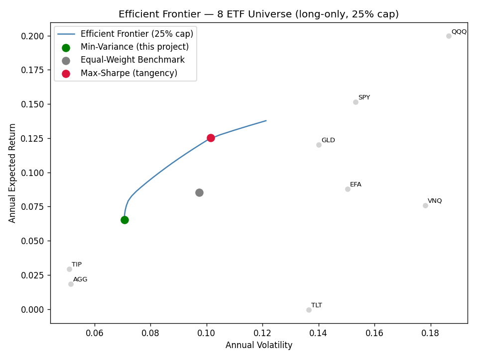
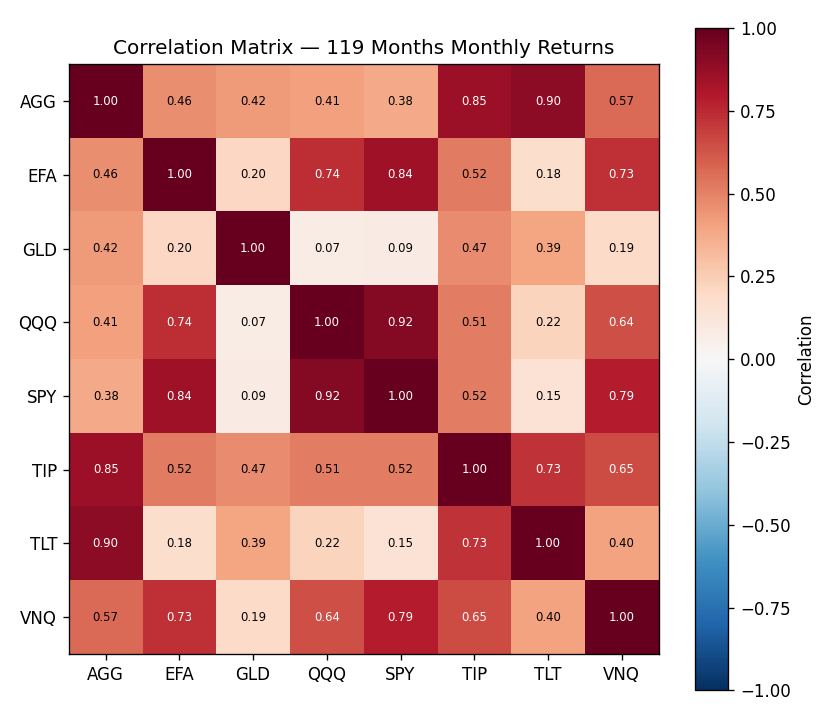
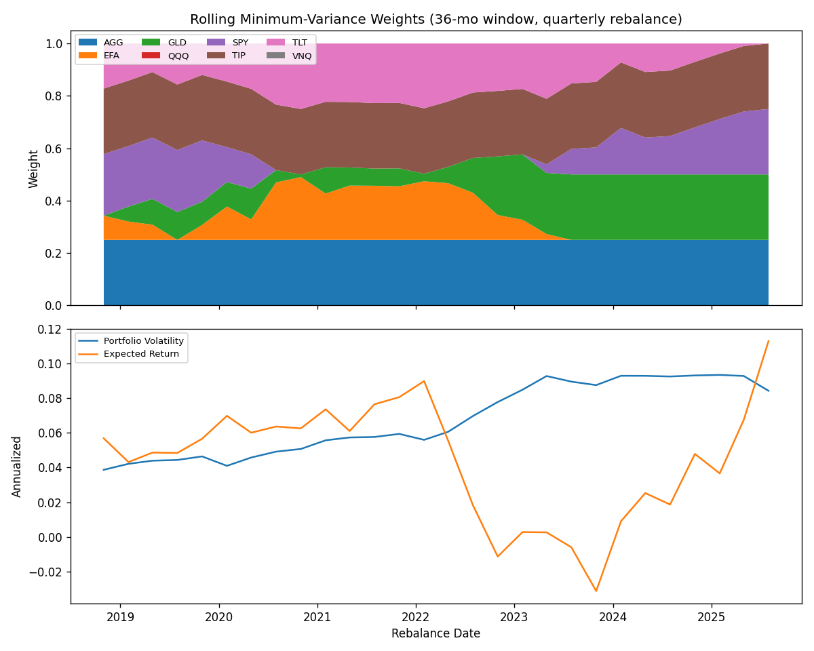

# Portfolio Optimization — Minimum-Variance Allocation Across an 8-ETF Universe

A long-only minimum-variance portfolio optimizer built on 119 months (Oct 2015–Aug 2025)
of historical returns across 8 ETFs spanning equities, bonds, gold, and real estate.

## Objective

Minimize portfolio volatility — not maximize return, not maximize Sharpe — subject to:

- Long-only positions (no shorting)
- No single ETF exceeds 25% of the portfolio
- Weights sum to 100%

This is a deliberate risk-first design choice. Minimum-variance optimization uses
**only** the covariance matrix, not expected returns, which makes it far less sensitive
to estimation error than mean-variance (Markowitz) or maximum-Sharpe approaches —
expected-return forecasts are notoriously noisy, while volatility and correlation
estimates are comparatively stable.

$$\min_w \; w^T \Sigma w \quad \text{s.t.} \quad \sum_i w_i = 1,\quad 0 \le w_i \le 0.25$$

## Results

| Metric | Minimum-Variance Portfolio | Equal-Weight Benchmark | Max-Sharpe (Tangency) |
|---|---|---|---|
| Expected Annual Return | 6.54% | 8.53% | 12.51% |
| Annual Volatility | 7.06% | 9.74% | 10.15% |
| Sharpe Ratio (rf = 4%) | 0.36 | 0.46 | 0.84 |
| Effective # of Assets (1/HHI) | 4.70 | 8.00 | 4.00 |

The max-Sharpe portfolio looks better on paper, but it gets there by using the
(noisy, in-sample) expected-return estimates directly — it's the more fragile
solution out-of-sample. The min-variance portfolio trades some of that return for
a solution that doesn't depend on forecasting returns at all. Both are shown here
deliberately, to make that trade-off visible rather than asserted.

### Recommended Allocation

| Ticker | Asset Class | Weight |
|---|---|---|
| AGG | US Aggregate Bonds | 25.0% |
| TIP | TIPS (Inflation-Protected) | 25.0% |
| GLD | Gold | 21.1% |
| SPY | US Large-Cap Equities | 18.2% |
| TLT | Long-Term US Treasuries | 10.0% |
| EFA | Intl. Developed Equities | 0.7% |
| QQQ | Nasdaq-100 Growth | 0.0% |
| VNQ | US REITs | 0.0% |

### Efficient Frontier



The minimum-variance portfolio (green) sits at the leftmost point of the frontier —
by construction, no other long-only, 25%-capped combination of these 8 assets has
lower expected volatility.

### Correlation Structure



The allocation logic reads directly off this matrix:
- **GLD** is nearly uncorrelated with equities (0.07–0.21 vs. QQQ/SPY/EFA) — it earns
  a large weight because it's genuinely diversifying, not despite its own volatility.
- **TLT** is highly correlated with AGG (0.90) and TIP (0.73) — three assets exposed
  to the same rate/duration risk. The optimizer treats this as redundancy and caps
  TLT well below AGG/TIP.
- **QQQ and VNQ** get pushed to 0% — high standalone variance and high correlation
  to the equity/real-estate cluster already represented by SPY.

## Rolling Re-Optimization ("Live" Updates)

`src/rolling.py` re-solves the optimization on a 36-month trailing window, walked
forward quarterly across the full return history, to show how the allocation would
have drifted as market conditions and correlations changed.



Average one-way turnover per quarterly rebalance across the sample: **~4.9%**
(max single-period turnover: ~20%, around regime shifts). This is the practical
argument for *why* minimum-variance portfolios are rebalanced on a schedule (daily/
weekly/monthly) rather than continuously: the covariance matrix — and therefore the
optimal weights — only moves meaningfully over weeks to months. Re-solving on every
tick would mean trading against noise, not signal, while paying the transaction costs
of doing so.

## Repository Structure

```
portfolio-optimization/
├── README.md
├── requirements.txt
├── src/
│   ├── data.py        # Market data ingestion (yfinance) -> monthly returns
│   ├── optimize.py     # The QP solver: min-variance, max-Sharpe, efficient frontier
│   └── rolling.py       # Rolling-window re-optimization + turnover analysis
├── outputs/              # Generated CSVs and charts (reproducible via src/)
└── report/                # Client-facing PDF summary
```

## Reproducing This

```bash
pip install -r requirements.txt

# 1. Pull fresh data
python src/data.py --start 2015-10-01 --end 2025-08-31 --out outputs/asset_returns.csv

# 2. Solve the static minimum-variance portfolio (also runnable as a module)
python src/optimize.py

# 3. Roll the optimization forward through history
python src/rolling.py --returns-csv outputs/asset_returns.csv --window 36 --step 3
```

## Methodology Notes / Limitations

- **Sample covariance from 119 months is noisy**, especially estimating an 8x8
  covariance matrix. A natural next step is a shrinkage estimator (Ledoit-Wolf)
  to pull the sample covariance toward a more stable structured target.
- **Correlations are not stable** — they tend to rise toward 1 exactly during market
  stress, which is when diversification is needed most. This is a known limitation
  of variance-based approaches generally, not specific to this implementation.
- **This is backward-looking and static** by default; the rolling module addresses
  the "static" part but still assumes the recent past is a reasonable estimate of
  near-term risk, which isn't always true around regime changes.
- **No transaction cost modeling** in the base optimizer — turnover is reported
  separately in the rolling analysis as a proxy for realistic implementation cost.

## On Real-Time / Live Market Data

Minimum-variance optimization is a statistical exercise over a covariance matrix —
correlations between these assets don't meaningfully change tick-to-tick, so
re-optimizing on every price update would mostly add noise and trading costs rather
than accuracy. A realistic "live" version of this project:

- **Refreshes risk metrics continuously** (current exposure, realized vol) but
  **rebalances on a schedule** — daily/weekly at most for a portfolio like this.
- Can be built today on free/low-cost data (`yfinance`, [Alpaca](https://alpaca.markets/),
  [Polygon.io](https://polygon.io/), [IEX Cloud](https://iexcloud.io/)) — `src/rolling.py`
  is already structured to be pointed at any of these behind `src/data.py`.
- A Bloomberg API (`blpapi`) integration is the natural production-grade upgrade
  path, but it requires an active Bloomberg Terminal license and isn't accessible
  for an individual project — it's noted here as the institutional option rather
  than something implemented against a license this repo doesn't have.

## Disclosures

This analysis is based on historical returns and does not guarantee future
performance. Diversification does not eliminate the risk of loss. This material
is for informational and educational purposes only and does not constitute
personalized investment advice.
